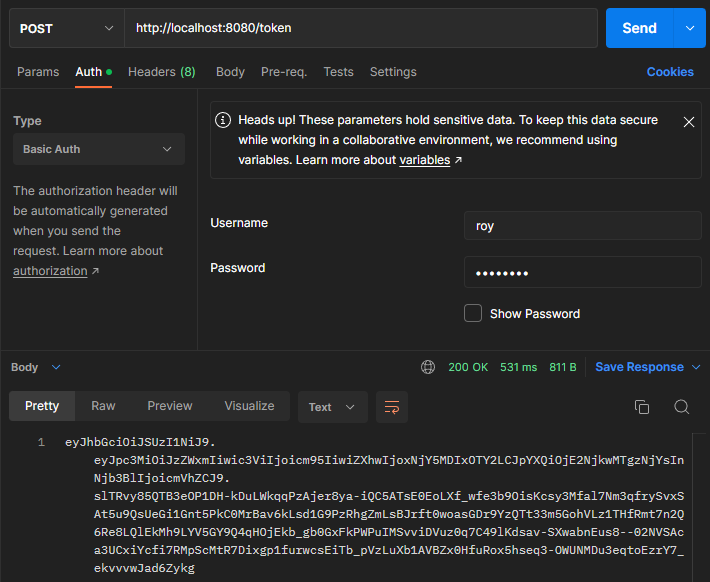
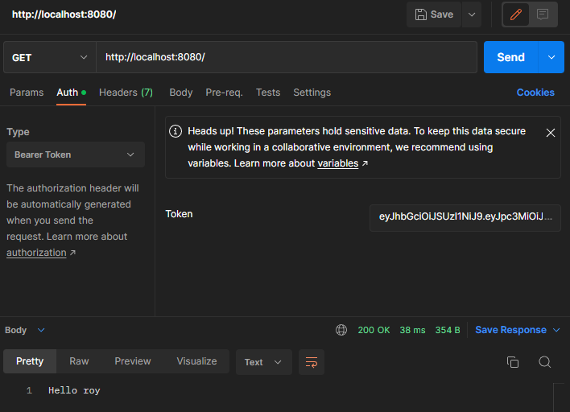

# Spring Security + JWT + Asymmetric Encryption

This repository is a walkthrough on how to use Spring security with jwt (asymmetric encryption) approach.

## Getting Started

To get you started you can simply clone the repository and install the dependencies

### Prerequisites

You need `Git` to clone the repository

You will need at least:

* [Java™ SE Development Kit 14](https://www.oracle.com/java/technologies/downloads/https:/)
* [Postman](https://www.postman.com/downloads/) or [Testfully](https://testfully.io/blog/testfully-desktop-app/https:/)
* [OpenSSL](https://www.openssl.org/source/)

### Clone

Clone the repository using git:

```bash
git clone https://github.com/rgaringoy/spring-security-jwt-asymmetric-encryption.git
cd spring-security-jwt-asymmetric-encryption.git
```

## Generate Private and Public Certificate

In order to generate the certificates, you must open terminal and run:

Under resources directory, create a new folder called `certs` and generate the certificate using RSA

```bash
mkdir certs
openssl genrsa -out keypair.pem 2048
openssl rsa -in keypair.pem -pubout -out public.pem
openssl pkcs8 -topk8 -inform PEM -outform PEM -nocrypt -in keypair.pem -out private.pem
```

## Run

To launch the server, simply run the application on the IDE that you are using.

The app will be available at:

http://localhost:8080/token


http://localhost:8080/

## Sample Output on Postman

First, you need to use the POST mapping request in order to get the returned `token`. Then under the Auth Tab, select the Type of `Basic Auth` and also fill out the `Username` and `Password`.




Second, you will need to copy the returned `token` from the POST mapping and use it on the GET mapping request. Then under Auth Tab, this time you need to select the `Bearer Token` and fill out the Token field and try to send. If the response is successfull, you will be able to see the "Hello Roy" as a proof that you are already authenticated by using the token that are previously generated under POST request.

